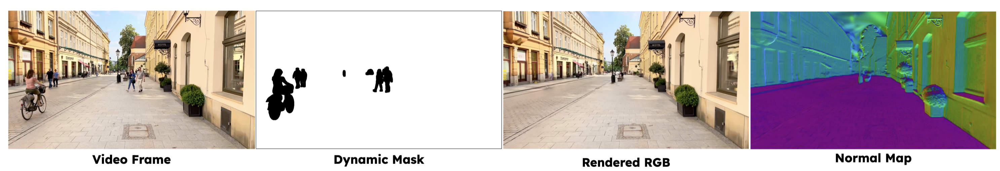
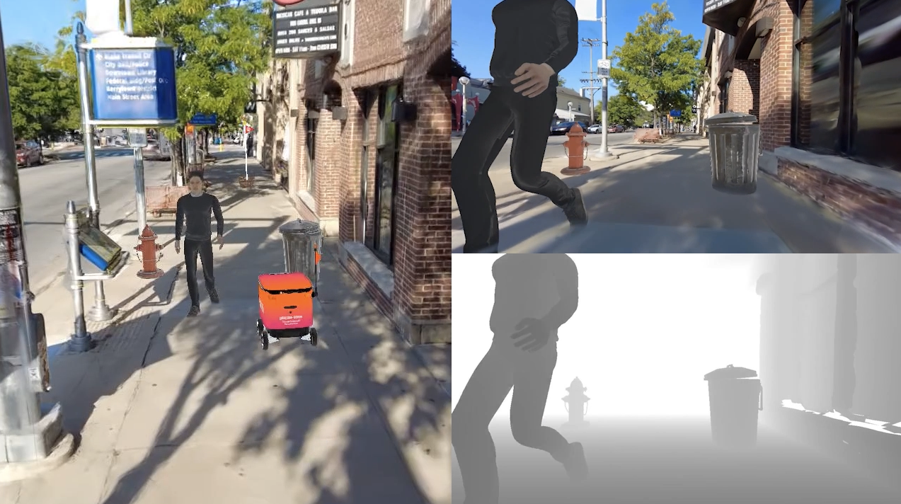
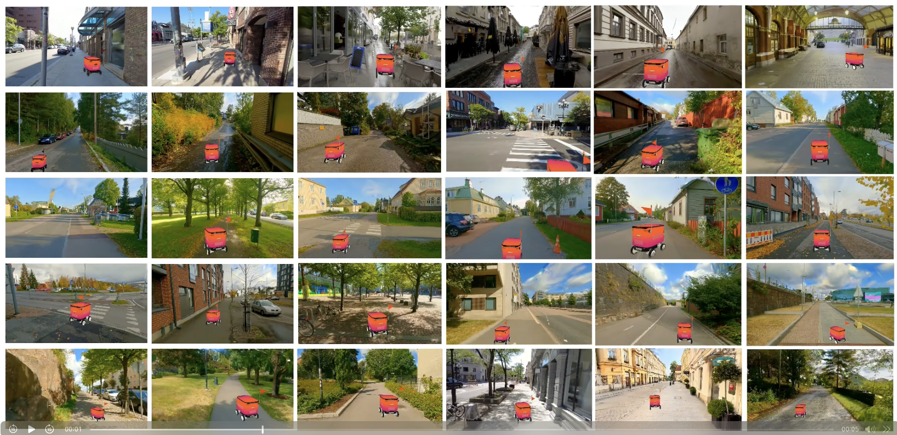

# 🎬 Vid2Sim 🤖: Realistic and Interactive Simulation from Video for Urban Navigation
> [Ziyang Xie](https://ziyangxie.site/), [Zhizheng Liu](https://scholar.google.com/citations?user=Asc7j9oAAAAJ&hl=en), [Zhenghao Peng](https://pengzhenghao.github.io/), [Wayne Wu](https://wywu.github.io/), [Bolei Zhou](https://boleizhou.github.io/)
>
> [](https://arxiv.org/abs/2501.06693)
> [](https://metadriverse.github.io/vid2sim/)

Vid2Sim is a novel framework that converts monocular videos into photorealistic and physically interactive simulation environments for training embodied agents with minimal sim-to-real gap.

<p align="center">
  
</p>


## 🚧 Installation 

```bash
# Clone the repository
git clone https://github.com/Vid2Sim/Vid2Sim.git --recursive
cd Vid2Sim

# Create a new environment
conda create -n vid2sim python=3.10
conda activate vid2sim

# Install dependencies
pip install -r requirements.txt

# Install reconstruction dependencies
pip install -e submodules/vid2sim-rasterizer
pip install -e submodules/vid2sim-deva-segmentation
pip install -e submodules/simple-knn

# Install RL dependencies
pip install -r src/vid2sim_rl/requirements.txt
pip install -e submodules/ml-agents
[Optional] pip install -e submodules/r3m
```

## 🎥 Reconstruct the simulation envs from videos
Vid2Sim transforms monocular videos into simulation environments by reconstructing the scene geometry and appearance. The generated environments preserve real-world diversity and visual fidelity, providing minimal sim-to-real gap for agent training.



👉 To get started, follow the reconstruction guide in [vid2sim_recon](src/vid2sim_recon/README.md) to reconstruct the simulation environment from video.

## 🤖 Train the Agent in Real-to-Sim Environments

After the environment is reconstructed, Vid2Sim translates the real-to-sim environments into a interactive environment with both realistic visual appearance and physical collision to train the agent in diverse situations.

👉 To set up the environment and launch RL training, refer to [vid2sim_rl](src/vid2sim_rl/README.md). 



## 📦 Repository Structure
```
Vid2Sim/
├── data/ # Source video data
├── envs/ # Reconstructed environments
├── src/
│   ├── vid2sim_recon/ # Reconstruct the simulation environment from video
│   ├── vid2sim_rl/ # Train the agent in real-to-sim environments
├── README.md # This file
```


## 📚 Vid2Sim Dataset

The Vid2Sim dataset includes 30 high-quality real-to-sim simulation environments reconstructed from video clips sourced from 9 web videos. Each clip includes 15 seconds of forward-facing video recorded at 30 fps, providing 450 frames per scene for environment reconstruction and simulation.  

We provide the source video data, reconstructed environments, and interactive Unity environments for agent training.

<p align="center">
  
</p>

## Citation 📝

If you find this work useful in your research, please consider citing:

```bibtex
@article{xie2024vid2sim,
  title={Vid2Sim: Realistic and Interactive Simulation from Video for Urban Navigation},
  author={Xie, Ziyang and Liu, Zhizheng and Peng, Zhenghao and Wu, Wayne and Zhou, Bolei},
  journal={CVPR},
  year={2025}
}
```
