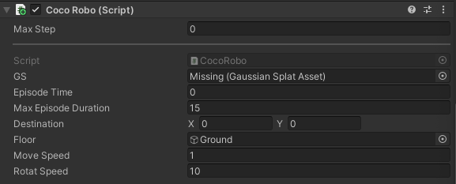

# 🏗️ Build Your Own Unity Environment for Vid2Sim

This guide will help you create your own Unity environment for Vid2Sim agent training using Unity 2022.3.4 with Gaussian Splatting rendering.

## 📋 Prerequisites

- Unity 2022.3.4f1 (LTS) or compatible version
- **Graphics API Requirements**: DX12, Metal, or Vulkan (DX11 will NOT work)
- Unity Gaussian Splatting Plugin
- Vid2Sim reconstructed environment data (meshes, Gaussian Splats, etc.)

## 🚀 Quick Start

### 1. Unity Project Setup

1. Create a new Unity 3D project using Unity 2022.3.4f1
2. **Configure Graphics API**:
   - Go to Edit → Project Settings → Player → Other Settings
   - Uncheck "Auto Graphics API" 
   - Ensure DX12 (Windows), Metal (Mac), or Vulkan is selected
3. Install the Unity Gaussian Splatting package:
   - Download or clone [UnityGaussianSplatting](https://github.com/aras-p/UnityGaussianSplatting)
   - Copy the `package` folder contents to your project's `Packages` directory
   - Or use Unity Package Manager: Window → Package Manager → "+" → "Add package from git URL" → `https://github.com/aras-p/UnityGaussianSplatting.git`

### 2. Project Structure

Your Unity project should follow this structure:
```
Assets/
├── Scripts/
│   ├── Agent/           # Agent behavior scripts
│   ├── Environment/     # Environment management scripts
│   └── Observations/    # Observation collection scripts
├── Scenes/
│   └── EnvironmentScene.unity
├── Materials/
│   └── DepthShader.shader
├── GaussianSplats/      # Gaussian Splat assets (.asset files)
│   ├── scene1.asset
│   └── scene2.asset
└── GLBAssets/           # Your GLB 3D assets as obstacles
    └── mesh/
        └── sample_obj/  # GLB files from reconstruction
```

### 3. Essential Scripts

Copy the following scripts from the `unity_envs` folder to your Unity project:

#### Required Scripts:
- **`BuildEnv.cs`** - Main agent behavior and environment logic
- **`DepthCamera.cs`** - Depth observation collection
- **`GLBLoader.cs`** - Dynamic 3D asset loading
- **`DepthShader.shader`** - Depth rendering shader

Place these scripts in your `Assets/Scripts/` directory with appropriate subfolders.

## 🔧 Environment Configuration

### 1. Gaussian Splat Environment Import

1. **Convert PLY files to Unity Assets**:
   - In Unity, go to `Tools → Gaussian Splats → Create GaussianSplatAsset`
   - Point `Input PLY/SPZ File` to your reconstructed Gaussian Splat PLY files
   - Supported formats: PLY (from 3DGS) or Scaniverse SPZ
   - Choose compression settings (Very Low quality is ~8MB and still usable)
   - Click "Create Asset" to generate the Unity-compatible asset

2. **Configure Rendering:**
   The Unity Gaussian Splatting plugin is used to render the Gaussian Splat scene. You can configure the rendering parameters to get the best visual quality.
   ```csharp
   // GaussianSplatRenderer parameters
   public GaussianSplatAsset asset;     // Your converted splat asset
   public bool debugDisplayChunks;      // Debug visualization
   public float splatScale = 1.0f;      // Scale multiplier for splats
   ```

### 2. Agent Setup

1. **Create the Agent GameObject:**
   - Import CocoRobot URDF/GLB or create an empty GameObject and name it "Agent"
   - Add the `CocoAgent` script (from BuildEnv.cs)
   - Based on the Agent Script, it will automatically add a Rigidbody component and a collider (CapsuleCollider recommended)
   - Most of the configuration can be dynamically changed in the training configuration (see `./config`).

2. **Configure Agent Components:**
   ```csharp
   // Key parameters in CocoAgent
   public GameObject GSGameObject;      // Reference to Gaussian Splat renderer
   public GaussianSplatAsset GS;        // Direct reference to splat asset
   public float moveMul = 1f;           // Movement speed multiplier
   public float rotateMul = 0.5f;       // Rotation speed multiplier
   public float successRange = 0.5f;    // Goal reaching distance
   public float maxEpisodeDuration;     // Episode time limit
   ```

   In most of the cases, you don't need to change the agent configuration. The default values are already good enough for most of the scenes.

   

3. **Camera Settings (Agent Obs)**  
   There are two types of camera setup on the agent for different observation modalities:

   1. **Main Camera:**
      - Child of Agent GameObject
      - Configure for RGB observations
      - Set appropriate field of view and resolution

   2. **Depth Camera:**
      - Duplicate Main Camera
      - Add `DepthCaptureEffect` script
      - Assign the depth material with `DepthShader`
      - Configure for depth observations

### 3. Environment Settings
Due to the complexity and diversity of the scene, some of the environment elements (e.g. the floor mesh, start/goal regions, etc.) are not auto generated. You need to add them manually.

1. **Floor/Ground:**
   - Create a large plane or terrain as the floor of the scene
   - Add appropriate colliders
   - Make it large enough to cover the entire scene
   - Add invisible texture to it to make it transparent to the agent's camera

2. **Start Region:**
   - Empty GameObject marking spawn area
   - Use for agent initialization

3. **Goal Region:**
   - Empty GameObject marking target area
   - Use for success detection

4. **Generate Region:**
   - Empty GameObject defining asset placement bounds
   - Used by GLBLoader for dynamic object spawning

5. **Obstacles:**
   - Place your reconstructed GLB files in `Assets/GLBAssets/mesh/sample_obj/`
   - Configure the folder path in your agent script:
   ```csharp
   private string folderPath = "path/to/your/GLBAssets/mesh/sample_obj";
   ```

## 🚀 Build Environments

After you have finished the environment setup, you can build the environment executable for training.

### Unity Build Settings

1. **Graphics API Configuration**:
   - Ensure DX12 (Windows), Metal (Mac), or Vulkan is selected
   - DX11 will NOT work with Gaussian Splatting

2. **Build the Unity Environment**:
   - Go to File → Build Settings
   - Add your environment scene
   - Set target platform (Linux)
   - **Important**: Check that graphics API is compatible
   - Build the executable

3. **Configure Environment for Training**:
   - Add the built environment executable path to your training configuration's `env_paths` parameter
   - Ensure the executable has proper permissions
   - The environment is now ready for RL training
   
4. **Cross-Platform Deployment**:
   - Environments built on one machine can be deployed to another with the same platform
   - Example: Build locally on Windows, deploy to Windows training server
   - `⚠️ WARNING` Ensure all dependencies and assets are included in the build and the asset path are correctly set in the training configuration.

Now you are ready to train your own agent!

---

## 📊 Environment Details
In the following sections, we will provide more details about the environment settings and the agent behavior. For you to better understand how Vid2Sim environment is built and how to customize your own environment.

### 1. 🤖 Observation Space

The environment provides multi-modal observations:

####  Visual Observations
- **RGB Camera**: 128*72 resolution
- **Depth Camera**: Same resolution as RGB
- **Stacked frames**: 5 frames for temporal information

#### Vector Observations
Apart from the visual observations, the agent also receives the following vector observations to get the ego velocity, and angular velocity of the agent and the displacement to the goal:

> To pass extra information to the python script for logging, the observation space is designed to be flexible. You can add any extra information to the observation space by adding the observation to the `CollectObservations` function.   
> In the script, we add extra collide count and collision rate to the observation space just for logging purpose.


### 🎮 2. Action Space

The agent action space is two continuous action space:
- **Linear Velocity**: To control the forward/backward movement of the agent
- **Angular Velocity**: To control the left/right rotation of the agent


### 🏆 3. Reward Function

For the navigation task, the reward function is designed to encourage the agent to reach the goal region and avoid collisions.  

As described in the [Vid2Sim paper (Sec D.1)](https://arxiv.org/pdf/2501.06693), We use the following reward function:
- **Terminate reward**: The agent receives a positive reward when it reaches the goal region and receives a negative reward when it fails to reach the goal region in time or collision limit is reached.
- **Distance-based reward**: The agent receives a negative reward proportional to the distance to the goal region.
- **Collide penalty**: The agent receives a negative reward when it collides with an obstacle.
- **Time penalty**: The agent receives a negative reward proportional to the time elapsed.
- **Steer smoothness reward**: The agent receives a positive reward when it steers smoothly.


### 🔄 4. Episode Management

The episode is terminated when the agent reaches the goal region (`currentDistance < successRange`) or the collision limit (`collisionLimit`) is reached or the episode time limit is reached (`episodeTime >= maxEpisodeDuration`).

```csharp
public override void OnActionReceived(ActionBuffers actionBuffers)
    {
        stepCount++;
        Act(actionBuffers);
        ApplyActionReward(actionBuffers);
        
        HandleCollision();
        CheckSuccess();
        CheckFail();
        ApplyTimePenalty();
        if (episodeTime >= maxEpisodeDuration){
            EndEpisode();
        }
        Debug.Log("Reward: " + GetCumulativeReward());
    }
```

---

## 📚 Additional Resources

- [Unity ML-Agents Documentation](https://github.com/Unity-Technologies/ml-agents)
- [Unity 2022.3 Documentation](https://docs.unity3d.com/2022.3/Documentation/Manual/)
